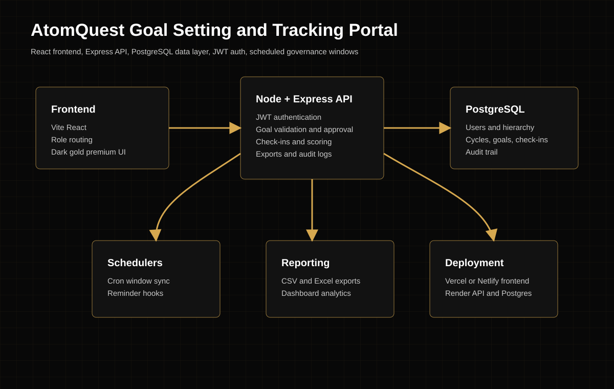

# AtomQuest Goal Setting and Tracking Portal

Full-stack hackathon project for AtomQuest Hackathon 1.0. The public homepage uses the requested premium black, gold, and white recruitment-platform style, while the authenticated product implements the goal-setting and achievement-tracking BRD.

## Stack

- Frontend: React + Vite
- Backend: Node.js + Express
- Database: PostgreSQL
- Authentication: JWT
- Exports: CSV and Excel
- Scheduled tasks: `node-cron` cycle window synchronization

## Project Structure

```text
.
├── client/                 React frontend
├── server/                 Express API
│   ├── src/db/migrations/  PostgreSQL schema
│   ├── src/routes/         Auth, goals, check-ins, admin, reports
│   ├── src/jobs/           Scheduled window enforcement
│   └── scripts/            Migration and seed commands
├── docs/
│   ├── api-endpoints.md
│   └── architecture.svg
├── docker-compose.yml      Local PostgreSQL
├── render.yaml             Render backend/database config
└── client/vercel.json      Vercel frontend config
```

## Local Setup

1. Copy environment files.

```bash
cp server/.env.example server/.env
cp client/.env.example client/.env
```

2. Start PostgreSQL.

```bash
docker compose up -d postgres
```

3. Install dependencies.

```bash
npm install
```

4. Run migrations and seed demo data.

```bash
npm run db:migrate
npm run db:seed
```

5. Start apps in two terminals.

```bash
npm run dev:server
npm run dev:client
```

Frontend: `http://localhost:5173`  
Backend health: `http://localhost:5000/api/health`

## Demo Credentials

All demo users use password `Password123!`.

| Role | Email |
| --- | --- |
| Employee | `employee@atomquest.dev` |
| Manager | `manager@atomquest.dev` |
| Admin/HR | `admin@atomquest.dev` |

The seed also creates `priya@atomquest.dev` for shared-goal push demos.

## Implemented Modules

- Employee goal creation and edit flow
- Total weightage validation, minimum 10% per goal, maximum 8 goals
- Manager approval with inline target and weightage edit
- Approval locking and Admin unlock workflow
- Shared departmental KPI push
- Quarterly check-ins with planned versus actual data
- Progress scoring for higher-better, lower-better, timeline, and zero-based goals
- Goal-setting and quarterly window enforcement
- Completion dashboard with distribution, QoQ trends, and manager effectiveness
- CSV and Excel achievement reports
- Audit trail for auth, goal, cycle, shared-goal, export, and post-lock actions
- Deployment scaffolding for Vercel and Render

## API Documentation

See [docs/api-endpoints.md](docs/api-endpoints.md).

## Architecture Diagram



## Deployment Notes

- Frontend: deploy `client/` to Vercel or Netlify, set `VITE_API_URL` to the backend `/api` URL.
- Backend: deploy `server/` to Render, AWS, or Azure, set `DATABASE_URL`, `JWT_SECRET`, and `CORS_ORIGIN`.
- Database: use managed PostgreSQL. Run `npm run db:migrate --workspace server` and `npm run db:seed --workspace server` once after provisioning.
